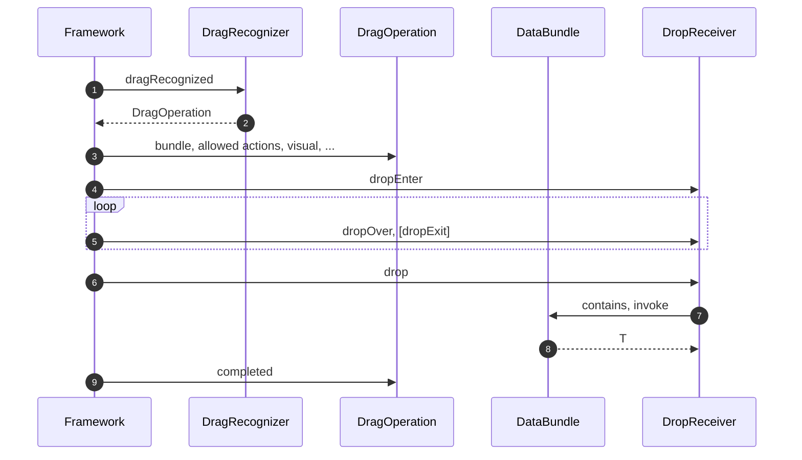

# Drag & Drop
-------------

Drag-and-drop is a form of data transfer between two Views or a View and an external component. The Views involved
can be within a single app, or separate apps; and the external component may be within a 3rd-party app entirely.

There key components involved in drag-and-drop sequence are: a [`DragRecognizer`](https://github.com/nacular/doodle/blob/master/Core/src/commonMain/kotlin/io/nacular/doodle/datatransport/dragdrop/DragRecognizer.kt#L63)
attached to a source View, [`DropReceiver`](https://github.com/nacular/doodle/blob/master/Core/src/commonMain/kotlin/io/nacular/doodle/datatransport/dragdrop/DropReceiver.kt#L20)
linked to a receiver View, and a [`DataBundle`](https://github.com/nacular/doodle/blob/master/Core/src/commonMain/kotlin/io/nacular/doodle/datatransport/DataBundle.kt#L133).
 
?> Either the source or target might be external to the app, meaning there might not be a recognizer or receiver at play.

The operation occurs when the user pressed and drags the mouse within a drag-and-drop source, then drags the mouse
onto a target and releases the button. Data will be captured from the source and provided to the target, where it can decide
whether and how to accept it.

## Required Module

You must include the [`DragDropModule`](https://github.com/nacular/doodle/blob/master/Browser/src/jsMain/kotlin/io/nacular/doodle/application/Modules.kt#L87)
in your application in order to enable drag-and-drop. This module imports the [`PointerModule`](https://github.com/nacular/doodle/blob/master/Browser/src/jsMain/kotlin/io/nacular/doodle/application/Modules.kt#L62)
as well, so you do not need to do so.

```kotlin
import io.nacular.doodle.application.Modules.Companion.DragDropModule

// ...

fun main() {
    // Launch MyApp with drag-drop enabled
    application(modules = setOf(DragDropModule /*,...*/)) {
        MyApp(/*...*/)
    }
}
```

## Creating A Source

You can create a drag source by attaching a `DragRecognizer` to any `View`. The recognizer is responsible for initiating
the operation in response to a drag [`PointerEvent`](https://github.com/nacular/doodle/blob/master/Core/src/commonMain/kotlin/io/nacular/doodle/event/PointerEvent.kt#L10).
This is done by implementing `dragRecognized`:

```kotlin
interface DragRecognizer {
    fun dragRecognized(event: PointerEvent): DragOperation?
}
``` 

The operation begins whenever a receiver returns a non-null [`DragOperation`](https://github.com/nacular/doodle/blob/master/Core/src/commonMain/kotlin/io/nacular/doodle/datatransport/dragdrop/DragRecognizer.kt#L14)
from `dragRecognized`. The `DragOperation`
contains the transfer data, user action (copy, move, link), and visual used to provide feedback during the operation.
This object represents the entire lifecycle of the operation and is notified when dragging begins, completes, or is canceled.
This allows the source to update based on the outcome of the operation.

```kotlin
button.dragRecognizer = object: DragRecognizer {
     override fun dragRecognized(event: PointerEvent) = object: DragOperation {
         override val bundle         = textBundle(text)
         override val allowedActions = setOf(Copy, Move)
         override val visualOffset   = event.location
         override val visual         = object: Renderable {
             override val size = Size(button.width, button.height * 2)

             override fun render(canvas: Canvas) {
                canvas.text(text, color = Red)
             }
         }

         override fun completed(action: Action) {
             if (action == Move) text = ""
         }
     }
 }
```
```doodle
{
    "height": "100px",
    "border": false,
    "run"   : "DocApps.buttonDrag"
}
```


This is an example of a simple recognizer that allows the text from a button to be copied or moved to a target.

?> Having the `PointerEvent` that triggered the drag lets a recognizer decide which subregion in a View a drag can happen from.
It can also produce different data from different regions in a single View.

## Receiving Drops

You receive drops by attaching a `DropReceiver` to any `View`. Dragging the mouse over the receiver's companion `View`
during a drag-and-rop triggers the `dropEnter` event. Subsequent mouse movement results in `dropOver` or `dropExit` events; and
releasing the mouse sends the `drop` event. Each of these events provide a [`DropEvent`](https://github.com/nacular/doodle/blob/master/Core/src/commonMain/kotlin/io/nacular/doodle/datatransport/dragdrop/DropReceiver.kt#L9)
with information about the data being transferred and the user's intended action.

The `DropReceiver` indicates whether the current drop operation is allowed by returning `true` on any of these events. Or, it
can return `false` to signal the drop is not allowed.

```kotlin
button.dropReceiver = object: DropReceiver {
     override val active = true

     private  fun allowed          (event: DropEvent) = PlainText in event.bundle
     override fun dropEnter        (event: DropEvent) = allowed(event)
     override fun dropOver         (event: DropEvent) = allowed(event)
     override fun dropActionChanged(event: DropEvent) = allowed(event)
     override fun drop             (event: DropEvent) = event.bundle[PlainText]?.let { button.text = it; true } ?: false
 }
```
```doodle
{
    "height": "100px",
    "border": false,
    "run"   : "DocApps.buttonDrop"
}
```

This is a simple receiver that accepts [`PlainText`](https://github.com/nacular/doodle/blob/master/Core/src/commonMain/kotlin/io/nacular/doodle/datatransport/DataBundle.kt#L84)
data and assigns it to the button's text. Try dragging some text onto the button. You can even drag from the previous app's button.

?> A `View` can be a source and target for drag-and-drop simultaneously.

## Data Bundles

The `DataBundle` class manages the underlying data that is transfered between the source and target. This interface
has two key methods: `contains` and `get`: both take a [`MimeType`](https://github.com/nacular/doodle/blob/master/Core/src/commonMain/kotlin/io/nacular/doodle/datatransport/DataBundle.kt#L45).

```kotlin
interface DataBundle {
    operator fun <T> get     (type: MimeType<T>): T?
    operator fun <T> contains(type: MimeType<T>): Boolean

    //...
}
```

The `contains` method checks whether the bundle has data that matches the given mime-type, and `get` returns it.

## Event Sequence

The full sequence of events for an operation goes something like this:



## Handling Dragged Files

Drag-and-drop also supports file transfer. This is handled via a `DropReceiver`--just like any other data type, with
the [`Files`](https://github.com/nacular/doodle/blob/master/Core/src/commonMain/kotlin/io/nacular/doodle/datatransport/DataBundle.kt#L98)
mime-type indicating which file types are allowed.

```kotlin
object: DropReceiver {
    private val allowedFileTypes = Files(PlainText, Image("jpg"), TextType("csv"))

    override val active = true

    private  fun allowed          (event: DropEvent) = allowedFileTypes in event.bundle
    override fun dropEnter        (event: DropEvent) = allowed(event)
    override fun dropOver         (event: DropEvent) = allowed(event)
    override fun dropActionChanged(event: DropEvent) = allowed(event)
    override fun drop             (event: DropEvent) = event.bundle[allowedFileTypes]?.let { files ->
        files.forEach {
            //...
        }
        true
    } ?: false
}
```

Try dragging files into the table below. The app will only allow files whose types are selected in the list. The `Files` mime-type
fetches a collection of files from the bundle, which allows a receiver to handle multiple files in a single drop.

```doodle
{
    "height": "300px",
    "border": false,
    "run"   : "DocApps.fileDragDrop"
}
```